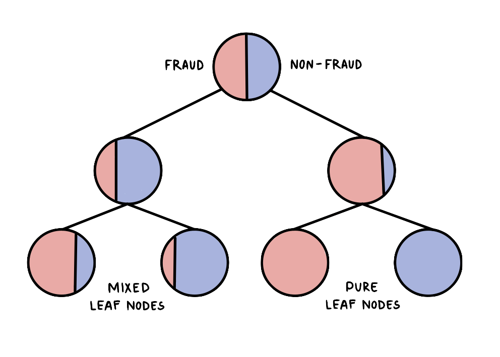

  * [Introduction](#introduction)
  * [Analysing the data](#analysing-the-data)
  * [Distribution of Raw Data](#distribution-of-raw-data)
    + [Time](#time)
    + [Amount](#amount)
    + [Analysis of remaining features](#analysis-of-remaining-features)
  * [Undersampling data for equal distribution](#undersampling-data-for-equal-distribution)
- [Predictive models](#predictive-models)
  * [Decision Trees](#decision-trees)
  * [K-nearest Neighbor](#k-nearest-neighbor)
    + [What's the best value for K?](#what-s-the-best-value-for-k-)
  * [Logistic Regression](#logistic-regression)
  * [Deep Learning](#deep-learning)
    + [Scaling](#scaling)
    + [Training with Tensorflow](#training-with-tensorflow)
      - [Activation Function](#activation-function)
      - [Loss Function](#loss-function)
- [Evaluation of results](#evaluation-of-results)
  * [Evaluation Metrics](#evaluation-metrics)
    + [Precision-recall vs ROC curve](#precision-recall-vs-roc-curve)
  * [Testing](#testing)
    + [Deep Learning](#deep-learning-1)
    + [ROC comparison](#roc-comparison)
  * [Final Results](#final-results)
- [Compiling of code](#compiling-of-code)
- [References](#references)

<small><i><a href='http://ecotrust-canada.github.io/markdown-toc/'>Table of contents generated with markdown-toc</a></i></small>

## Introduction 

The analysis of bank transactions to predict credit card fraud using various classification models in Python. Includes the visualization and undersampling of a highly imbalanced dataset. Discusses and implements supervised learning methods such as decision trees, k-nearest neighbor, and logistic regression. The project also covers deep learning with Tensorflow but this is not included in the final evaluation of results.

## Analysing the data

For this project, the following dataset is used [`creditcard.csv`](creditcard.csv). The dataset contains transactions made by credit cards in September 2013 by European cardholders. The used dataset is available for download on [Kaggle](https://www.kaggle.com/mlg-ulb/creditcardfraud/version/3).
 **In order to run the code please download the .csv file from the link, the file was too large to be uploaded to GitHub.**

The data includes 284,807 transactions of which 492 were detected as fraud. This is represented under the "Class" column as a binary value.


Frauds account for 0.1727% of all transactions in this dataset. To avoid overfitting of this highly imbalanced dataset, we can apply undersampling to it.

```python
print(df.columns)
```

    Index(['Time', 'V1', 'V2', 'V3', 'V4', 'V5', 'V6', 'V7', 'V8', 'V9', 'V10',
           'V11', 'V12', 'V13', 'V14', 'V15', 'V16', 'V17', 'V18', 'V19', 'V20',
           'V21', 'V22', 'V23', 'V24', 'V25', 'V26', 'V27', 'V28', 'Amount',
           'Class'],
          dtype='object')

As can be seen, the transactions have 31 features, out of which 3 are `time`, `amount`, and `class`. The remaining features were transformed using PCA dimensionality reduction to protect user data.

There is no missing data in any of these columns, this was done using the command `df.info()` and `df.isnull().sum().max()`. 

## Distribution of Raw Data

We can look at the distribution of non-fraudulent compared to fraudulent cases for the two non-PCA features.

### Time

The feature 'Time' contains the seconds elapsed between each transaction and the first transaction in the dataset. When comparing normal transactions to fraudulent ones we can see that normal transactions follow a more cyclic distribution as opposed to fraudulent cases. This can be explained by the frequency of fraudulent transactions during 'off-peak' hours. The pattern can also be due to the high imbalance of data, allowing for fraudulent cases to be more arbitrary. 


### Amount

The amount feature is pretty self-explanatory, referring to the amount transferred during a transaction.


The plot demonstrates how the majority of transactions are small amounts for both normal and fraudulent cases. 

### Analysis of remaining features

As mentioned the remaining 28 features V1, V2, … V28 are the principal components obtained with PCA. We can look at the distribution of these features to determine which features display a higher or lower correlation between fraudulent and non-fraudulent cases. This is very important due to the fact that we cannot and should not consider all the 31 features when training our model. Too many features can result in overfitting. For this reason, we will not consider highly correlated features.


By looking at the plots, we can see that the following features: V13, V15, V22, V25
are highly correlated thereby not proven useful in the training of our model. For this reason, we will drop the listed features. 

For future references, it is advised to not do this feature selection manually because our random undersampling method results in different correlation metrics between the two classes. The above-mentioned features may vary depending on the undersample from the non-fraudulent cases. For `random.seed(100)` the above-mentioned features are eliminated in the normalization process.

## Undersampling data for equal distribution

We need to either undersample or oversample the dataset to get accurate results from our predictive model. Machine learning algorithms do not work well with unbalanced classes because they treat the minority class as noise or outliers leading to misclassification and a low accuracy rate when validating the model. For this project, I will choose to undersample given the fact that it requires less storage and has lower runtime due to the reduced number of training data

The function `randomUndersample()` **randomly** samples non-fraudulent cases to then drop them from the dataset, leaving 492 remaining non-fraudulent cases which gives an equal distribution of both classes. 

The disadvantages of undersampling, in this case, is that:

-   given the algorithm randomly chooses a subset from the non-fraudulent data, the sample used for training may be biased and result in different results each time.

# Predictive models

We can split the data into training and test data using the `train_test_split()` function from the _sklearn.model_selection_ library. The training set consists of 80% of the data and the test set 20%.

For this project, we will use an open-source machine learning library [scikit-learn](https://scikit-learn.org/stable/) to implement and discuss different prediction models for our data.

We are dealing with the classification of unlabeled data, meaning we are trying to make accurate predictions based on the features of the data. This is a supervised learning problem that can be met with the following methods.

## Decision Trees

This method can be used for both classification and regression tasks. A decision tree uses the different features of the dataset to create "yes/no" questions, by doing this we can split the dataset each time we are given the value of a feature. Splitting the dataset creates new _nodes_. For example, the decision tree can ask whether the amount of a transaction is over 10k and split the data that is under 10k in one node and the data over 10k in another node. The splitting of nodes can continue until there are no more rules to apply or there is only one data point left in each leaf node. A leaf node is a node that is no longer split, meaning it doesn't have any daughter nodes. The algorithm will aim to separate the dataset such that each leaf node belongs to a single class. These are called pure leaf nodes (as seen on the bottom right of the image). However, the leaf nodes commonly end up being mixed rather than pure. The algorithm must assign **one** of the classes to each leaf node, in the case of a mixed node, the algorithm will decide to assign the majority class. So on the picture, we could see that the left-most mixed leaf node is assigned as fraudulent because the majority of the data points in that node are instances of fraud. 



Advantages: 

-   Little data preparation, doesn't require normalization of data or removing of blank values
-   Able to handle both numerical and categorical data
-   Cost is logarithmic 
-   Able to handle both numerical and categorical data

Disadvantages:

-   Unstable, minor changes in data can change the entire structure in a tree leading to various results

## K-nearest Neighbor

This method is also available for use in regression. A data point is classified by a majority vote of its neighbors' class. The variable K determines how many neighbors are considered in the classification of a point. For example, if K=3 then we look at the 3 closest points to our point and look at the classes they belong to, if 2 or more points belong to class 0 then the point being predicted is also classified as belonging to class 0.

Advantages: 

-   No training is required because the algorithm simply goes through the data points to compare them to each other using the distance function

Disadvantages:

-   Doesn't work well with large datasets because calculating a large number of distances degrades the performance of the algorithm
-   Unable to handle high dimensions
-   Sensitive to noise and missing values

### What's the best value for K?

Depending on how many classes a dataset contains, in the case of fraudulent or non-fraudulent, the K value should be an odd number to avoid any ties between classes. When it comes to how large the value should be, one should keep in mind that larger K values reduce the effect of noise on classification however can result in underfitting by making boundaries between classes less distinct. An optimal K value for your dataset can be found using various heuristic techniques.

## Logistic Regression

Logistic regression, a supervised learning algorithm can also be applied to our dataset.
Binary logistic regression assumes binary variables and the desired outcome as factor level 1. Logistic regression can also be applied to more than two binary outcomes, when none of the types have any quantitative significance, this is known as multinomial logistic regression. The binary model is based on the logistic function also known as the sigmoid function often used in statistics.

 where 

Theta represents our loss function, which helps measure how well the algorithm performs using the weights on functions. Lets define our loss function:


The primary goal is to minimize the loss function, this can be done with the increasing and decreasing of different weights.

## Deep Learning

### Scaling

The PCA features have values close to 0 while Amount and Time reach beyond 2000. In order, to avoid confusing the neural network to assume higher values are of greater importance, we will use `StandardScaler` from Scikit-Learn library to fit and transform the data.

### Training with Tensorflow

#### Activation Function

The activation function determines the threshold at which a neuron should be activated. To train a binary classification model with Tensorflow, we must first activate one neuron with a **sigmoid function** to make it able to give us a probability of either being fraud or non-fraud. It maps any to an output ranging from 0 to 1. So smaller values are closer to 0 and larger values closer to 1.

#### Loss Function

The loss function helps the neural network determine how to update the weights given the difference between the expected output and the predicted output. Given that we are using the network for classification then we will use a cross-entropy based loss function more specifically **binary cross-entropy** because we only have two classes, whereas if we had more we would refer to categorical cross-entropy. The loss is calculated according to the following formula, where y represents the expected outcome, and y hat represents the outcome produced by our model


For example, the neural network is fed a fraudulent (labeled 1) case and a non-fraudulent case (labeled 0). The network is 80% confident that the first case is fraudulent meaning $y = 1$ and $\\hat{y} = 0.8$. After plugging these values into our equation we get $L = 0.32$. Now the neural network adjusts the weights accordingly by calculating the average over the loss overall to attain the cost:


Can also be written as:


# Evaluation of results

## Evaluation Metrics

In order to understand the results better I will briefly go over the necessary terms:

-   True Positive (TP): A fraudulent transaction that is predicted as a fraudulent transaction

-   True Negative (TN): A normal transaction that is predicted as a normal transaction 

-   False Positive (FP): A normal transaction that is predicted as a fraudulent transaction

-   False Negative (FN): A fraudulent transaction that is predicted as a normal transaction

We can use a confusion matrix to display the predicted labels according to the true labels.


The **accuracy** represents the number of correctly predicted transactions (both TP and TN) over the total number of transactions:


Accuracy is not a good measure if the dataset is not balanced and in our case, we are mainly focusing on true negatives, that is correctly predicting fraudulent transactions. A poor model can still result in a high accuracy rate which is why we will focus more on an F1 score which is the weighted average of precision and recall.

First, let's look at recall and precision. **Recall**, the true positive rate, is the percentage of correctly predicted frauds (TP) over the sum of TPs and FNs:


**Precision**, the positive predictive value is similar to recall however, the percentage is calculated over the total of TPs and FPs:


Both of these measures are important for evaluating our predictive model, however, given that we are dealing with bank transactions then I believe it is more important to focus on misclassified normal (predicted as non-fraud when actually fraud) transactions rather than misclassified fraudulent (predicted as fraud when actually non-fraud) transactions. This is because wrongly predicting a normal transaction as a fraudulent one has a less significant impact than predicting a fraudulent transaction as a normal one. For this reason, we will pay more attention to achieving a high recall score.

Now that we know about precision and recall let us look at an **F1 score** which takes both false positives and false negatives into account. The F1 score can be found using both recall and precision:


### Precision-recall vs ROC curve

Given that our model gives the probability of being either fraud or non-fraudulent to each test case, how can we determine the threshold at which a case is considered fraudulent? For example, the default skit-learn function predict() has a threshold of 0.5 meaning any case that is greater than 0.5 is considered fraudulent and below 0.5 is considered a normal transaction. However, depending on the problem and goal of the data, we may want to tune any of the mentioned evaluation metrics by setting our own threshold. 

We are dealing with a binary classification problem which means have two different types of errors: false positives and false negatives. The change of these errors given different classification thresholds can be displayed using a ROC curve. 


By looking at the true positive rate we can see it is identical to recall.


Given a curve, we can calculate the AUC (area under the curve) which can help determine the performance measure of each model. A larger AUC accounts for a better model.

A PR (Precision-recall) curve is used more in the case of imbalanced data, however, for the purpose of this project, we will not be improving evaluation metrics of imbalanced data. For this reason, we will compare different models using only the AUC and the ROC curve. 

## Testing

Let's take a look at the current results of our undersampled training data, without cleaning the data or applying a different threshold from the ROC curve. With the same training and testing data, we have the following evaluation metrics for each of the classifier models.

| Metrics   | Decision Trees | K-Nearest Neighbor | Logistic Regression | Deep Learning |
| :-------- | -------------: | -----------------: | ------------------: | ------------: |
| Recall    |          92.1% |              63.7% |               92.1% |         85.9% |
| Precision |            93% |              62.5% |               95.9% |          100% |
| F1 score  |          92.6% |              63.1% |                 94% |            x% |

As can be seen from the table above, the deep learning algorithm performs the best with a recall rate of 100%. However, we can not rely on this result too heavily because it may be the result of overfitting. Let's first see if we can improve any of the other models by cleaning the data of the previously mentioned features. 

| Metrics after normalization | Decision Trees | K-Nearest Neighbor | Logistic Regression | Deep Learning |
| :-------------------------- | -------------: | -----------------: | ------------------: | ------------: |
| Recall                      |          91.1% |              63.7% |                 95% |         98.2% |
| Precision                   |            93% |              62.5% |                 97% |         97.7% |
| F1 score                    |            92% |              63.1% |                 96% |            x% |

We can see that cleaning the data only improved the metrics of the logistic regression model. Other classification models showed a decrease in performance. This could be due to fewer features available for training or the fact that the chosen features were less correlated than assumed and were critical in the improvement of the model.

### Deep Learning

After multiple tests with different samples from our undersampling method, it can be observed that our neural network has varying performance measures meaning the performance is very dependent on the sample. Drastic variations in evaluation metrics was not the case with the other classification models. The undersampling method reduces the amount of non-fraudulent cases randomly, therefore, each time we train the model, it is probable that the chosen sample for training has less correlated features compared to the fraudulent cases allowing for better distinction. In addition, I am not very familiar with the TensorFlow model architecture to prevent overfitting or adjust the model parameters accordingly. This can be an extension of this project, however, for this particular project, the TensorFlow model should be disregarded and is useful for only observation purposes.

### ROC comparison

Decision Tree


K-nearest Neighbor


Logistic Regression


As we can see the K-nearest neighbor has the smallest area under the curve making it the least reliable model for predictions. We can adjust our threshold to slightly improve our performance measures. A higher threshold will result in higher precision while a lower threshold results in a higher recall. When setting the threshold to 0.2 we can observe the F1 score increasing by 5%, however, this is still not a match to the other models.

## Final Results

To determine the best classification model for the given dataset, we will look at the difference in performance metrics of the Decision Tree classifier and Logistic Regression. Logistic Regression performed slightly better in terms of performance metrics. When we normalize the data, we can reach a recall of 95%. If we want to increase recall we can lower our threshold. This means that the rate of false positives increases, however, it allows us to reduce the probability of falsely predicting a fraudulent transaction which I believe in a bank setting would ultimately have more consequences. 

# Compiling of code

Make sure the dataset file is downloaded first (see [Analysing the data](#analysing-the-data) section).

Everything is done in the file `fraud_main.py`. To run the code one must run this file. The runtime varies depending on the chosen classification method. It takes approximately 48 seconds to display user preferences. 
User preferences ask which model the user would like use for classification. This can be done with the input of either 1,2,3 or 4. Then the performance metrics are displayed once the classifier is done training and testing the data.
Currently all the figures are commented out to avoid increased runtime, in order to display figures, normalize data etc. please see the comments in the code.

# References

[An Introduction to Neural Network Loss Functions](https://programmathically.com/an-introduction-to-neural-network-loss-functions/#:~:text=The%20loss%20function%20in%20a,all%20losses%20constitutes%20the%20cost.)

[Bento, C. (2021, July 18). Decision tree classifier explained in real-life: Picking a vacation destination.](https://towardsdatascience.com/decision-tree-classifier-explained-in-real-life-picking-a-vacation-destination-6226b2b60575)

[Classification Algorithms - Logistic Regression.](https://www.tutorialspoint.com/machine_learning_with_python/classification_algorithms_logistic_regression.htm)

[Decision Trees](https://scikit-learn.org/stable/modules/tree.html#tree)

[Karakaya, M. (2021, July 26). How to solve Binary Classification Problems in Deep Learning with Tensorflow & Keras?](https://medium.com/deep-learning-with-keras/which-activation-loss-functions-part-a-e16f5ad6d82a)

[Radečić, D. (2021, October 14).
How to Train a Classification Model with TensorFlow in 10 Minutes.](https://towardsdatascience.com/how-to-train-a-classification-model-with-tensorflow-in-10-minutes-fd2b7cfba86#ccbc)

[Vidhya, S. (2021, December 15). How To Plot Confusion Matrix In Python And Why You Need To?](https://www.stackvidhya.com/plot-confusion-matrix-in-python-and-why/)
